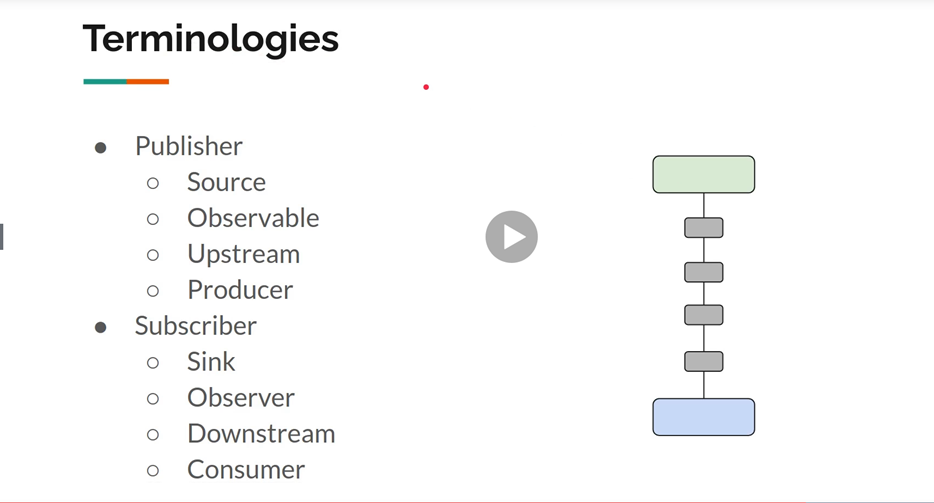
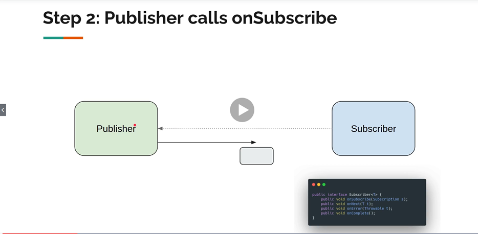
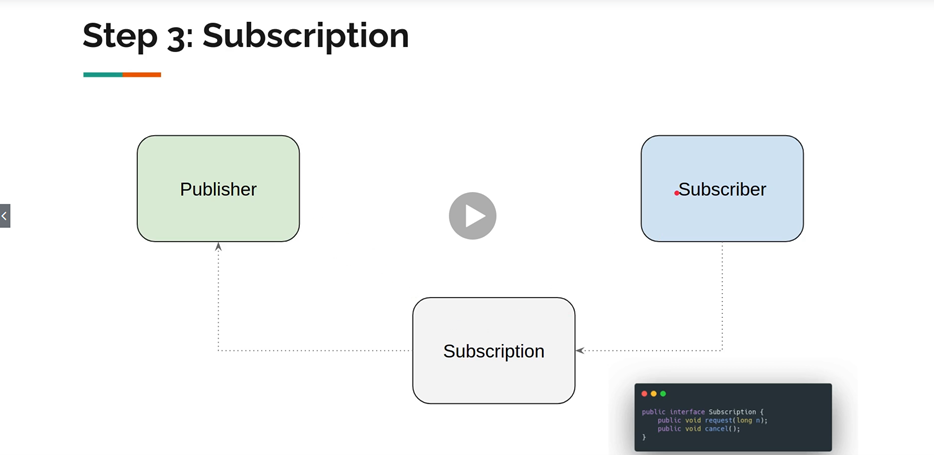
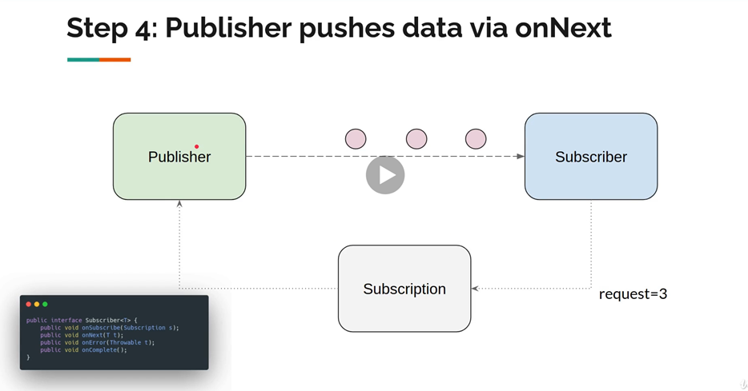
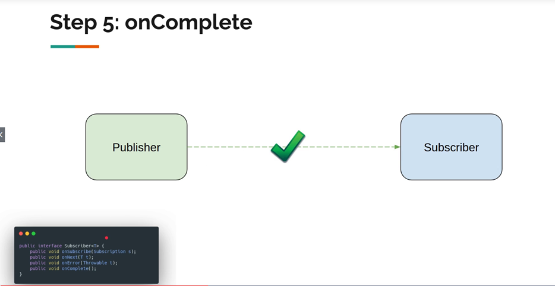
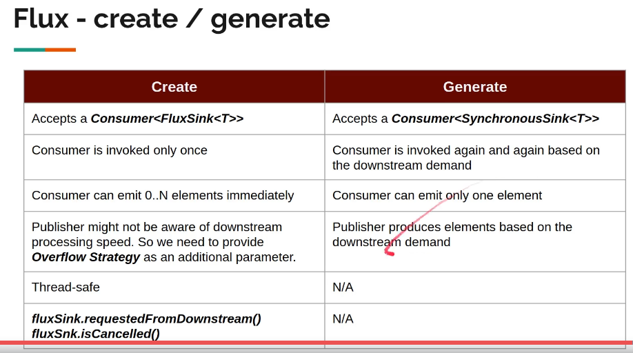
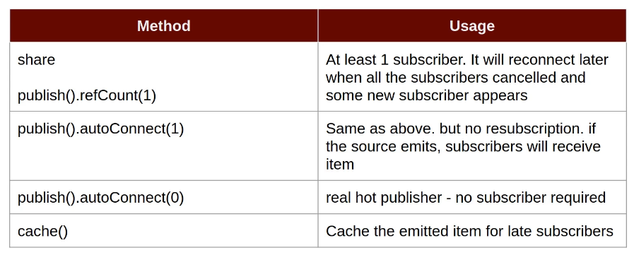

= Spring Reactor
:toc:
:icons: font
:url-quickref: https://docs.asciidoctor.org/asciidoc/latest/syntax-quick-reference/

== Spring Reactor

image::img/flux-basic-step1.png[]

== Flux - Emitting Items Programmatically

https://github.com/mwwojcik/mw-chat/blob/main/src/test/java/mw/chat/reactor/ReactorFluxGenerateAndCreateComparisonTest.java[See: ReactorFluxGenerateAndCreateComparisonTest.java]

https://github.com/mwwojcik/mw-chat/blob/main/src/test/java/mw/chat/reactor/ReactorFluxCreateTests.java[See: ReactorFluxCreateTests.java]

https://github.com/mwwojcik/mw-chat/blob/main/src/test/java/mw/chat/reactor/fileservice[See: Reactive text file content]

== Cold and Hot Publishers

https://www.vinsguru.com/reactor-hot-publisher-vs-cold-publisher/

*Cold Publisher* (Netflix)
----
Publishers by default do not produce any value unless at least 1 observer subscribes to it. Publishers create new data producers for each new subscription.
----

https://github.com/mwwojcik/mw-chat/blob/main/src/test/java/mw/chat/reactor/coldhot/ColdPublisherTest.java[See: ColdPublisherTest.java]

*Hot Publisher* (TV,Radio)

----
Hot Publishers do not create new data producer for each new subscription (as the Cold Publisher does). Instead there will be only one data producer and all the observers listen to the data produced by the single data producer. So all the observers get the same data.
----

https://github.com/mwwojcik/mw-chat/blob/main/src/test/java/mw/chat/reactor/coldhot/HotPublisherTest.java[See: HotPublisherTest.java]

.Image caption

