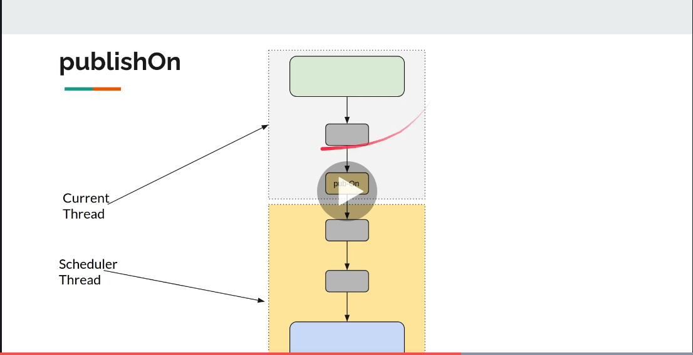

= Spring Reactor
:toc:
:icons: font
:url-quickref: https://docs.asciidoctor.org/asciidoc/latest/syntax-quick-reference/

== Spring Reactor

image::img/flux-basic-step1.png[width=80%]

image::img/flux-basic-step2.png[width=80%]

image::img/flux-basic-step3.png[width=80%]

image::img/flux-basic-step4.png[width=80%]

image::img/flux-basic-step5.png[width=80%]

== Flux - Emitting Items Programmatically

image::img/flux-create-generate.png[width=80%]

https://github.com/mwwojcik/mw-chat/blob/main/src/test/java/mw/chat/reactor/ReactorFluxGenerateAndCreateComparisonTest.java[See: ReactorFluxGenerateAndCreateComparisonTest.java]

https://github.com/mwwojcik/mw-chat/blob/main/src/test/java/mw/chat/reactor/ReactorFluxCreateTests.java[See: ReactorFluxCreateTests.java]

https://github.com/mwwojcik/mw-chat/blob/main/src/test/java/mw/chat/reactor/fileservice[See: Reactive text file content]

== Flux operators

=== DelayElements

https://github.com/mwwojcik/mw-chat/blob/main/src/test/java/mw/chat/reactor/operators/DelayElementsOperatorTest.java[See: DelayElementsOperatorTest.java]

image::img/flux-slack-quest.png[width=80%]

image::img/flux-slack-answer.png[width=80%]

=== FlatMap

https://github.com/mwwojcik/mw-chat/blob/main/src/test/java/mw/chat/reactor/operators/FlatMapOperatorTest.java[See: FlatMapOperatorTest.java]

=== Handle

https://github.com/mwwojcik/mw-chat/blob/main/src/test/java/mw/chat/reactor/operators/HandleOperatorTest.java[See: HandleOperatorTest.java]

=== IfEmpty
https://github.com/mwwojcik/mw-chat/blob/main/src/test/java/mw/chat/reactor/operators/IfEmptyOperatorTest.java[See: IfEmptyOperatorTest.java]

=== LimitRate
https://github.com/mwwojcik/mw-chat/blob/main/src/test/java/mw/chat/reactor/operators/LimitRateOperatorTest.java[See: LimitRateOperatorTest.java]

=== OnError
https://github.com/mwwojcik/mw-chat/blob/main/src/test/java/mw/chat/reactor/operators/OnErrorOperatorTest.java[See: OnErrorOperatorTest.java]

=== SwitchIfEmpty
https://github.com/mwwojcik/mw-chat/blob/main/src/test/java/mw/chat/reactor/operators/SwitchIfEmpty.java[See: SwitchIfEmpty.java]

=== Timeout
https://github.com/mwwojcik/mw-chat/blob/main/src/test/java/mw/chat/reactor/operators/TimeoutOperatorTest.java[See: TimeoutOperatorTest.java]

=== Transform
https://github.com/mwwojcik/mw-chat/blob/main/src/test/java/mw/chat/reactor/operators/TransformOperatorTest.java[See: TransformOperatorTest.java]

== Cold and Hot Publishers

https://www.vinsguru.com/reactor-hot-publisher-vs-cold-publisher/

*Cold Publisher* (Netflix)
----
Publishers by default do not produce any value
unless at least 1 observer subscribes to it.
Publishers create new data producers for each new subscription.
----

https://github.com/mwwojcik/mw-chat/blob/main/src/test/java/mw/chat/reactor/coldhot/ColdPublisherTest.java[See: ColdPublisherTest.java]

*Hot Publisher* (TV,Radio)

----
Hot Publishers do not create new data producer for each new subscription
(as the Cold Publisher does).
Instead there will be only one data producer and all the observers
listen to the data produced by the single data producer.
So all the observers get the same data.
----

https://github.com/mwwojcik/mw-chat/blob/main/src/test/java/mw/chat/reactor/coldhot/HotPublisherTest.java[See: HotPublisherTest.java]

.Image caption
image::img/hot-publisher.png[Hot and Cold Publishers - Summary,width=80%]

== Threading and scheduling

=== Default processing model

image::img/flux-scheduler-basic-thread.png[widht="80%"]

By default, all operations in single pipeline are executed in default Thread.

All steps block current thread!

[source]
----
  @DisplayName("Should execute all pipeline tasks in the same thread")
    @Test
    void shouldExecuteAllPipelineTasksInTheSameThread() {
        Flux flux = Flux.create(fluxSink -> {
            printThreadMessage("create");
            fluxSink.next(1);
        }).doOnNext(i->printThreadMessage("next"));
        flux.subscribe(i->printThreadMessage("Subscribe"));
    }
----

----
22:46:57.972 [Test worker] DefaultThreadingTest - Test worker=>create
22:46:57.972 [Test worker] DefaultThreadingTest - Test worker=>next
22:46:57.973 [Test worker] DefaultThreadingTest - Test worker=>Subscribe
----

In general, by default,  all steps of the process are performed in subscriber thread.
We can create a new thread, and make a subscription inside it.
In this case main thread is not blocked.

[source]
----
 @DisplayName("Should execute all pipeline tasks in subscriber thread")
    @Test
    void shouldExecuteAllPipelineTasksInSubscriberThread() {
        Flux flux = Flux.create(fluxSink -> {
            printThreadMessage("create");
            fluxSink.next(1);
        }).doOnNext(i->printThreadMessage("next"));

        Runnable r=()->flux.subscribe(i->printThreadMessage("subscribe"));

        for (int i = 0; i < 2; i++) {
            new Thread(r).start();
            Sleeper.sleepSecconds(1);
        }
        Sleeper.sleepSecconds(5);
     }
----

----
22:49:29.103 [Thread-3] DefaultThreadingTest - Thread-3=>create
22:49:29.104 [Thread-3] DefaultThreadingTest - Thread-3=>next
22:49:29.104 [Thread-3] DefaultThreadingTest - Thread-3=>subscribe

22:49:30.099 [Thread-4] DefaultThreadingTest - Thread-4=>create
22:49:30.099 [Thread-4] DefaultThreadingTest - Thread-4=>next
22:49:30.099 [Thread-4] DefaultThreadingTest - Thread-4=>subscribe
----

https://github.com/mwwojcik/mw-chat/blob/main/src/test/java/mw/chat/reactor/threading/DefaultThreadingTest.java[See: DefaultThreadingTest.java]

=== Schedulers and pools

https://spring.io/blog/2019/12/13/flight-of-the-flux-3-hopping-threads-and-schedulers[See: Flight of the Flux 3 - Hopping Threads and Schedulers]

Creating threads on your own is very inefficient and buggy, so the framework provides several pools, which we can use.

=== Scheduler operators

=== SubscribeOn operator
By default, both the producer and the subscriber work in the main thread, but if the subscribeOn() operator is used in the pipeline, the entire flow is switched to the new thread.
All pipeline steps will be run in the new thread.

[source]
----
  @DisplayName("Should switch execution to pooled thread after subscribeOn operator")
    @Test
    void shouldSwitchExecutionToPooledThreadAfterSubscribeOnOperator() {
        Flux.create(fluxSink -> {
            printThreadMessage("create");
            fluxSink.next(1);
        })
            .doFirst(() -> printThreadMessage("second"))
            .subscribeOn(Schedulers.boundedElastic())
            .doFirst(() -> printThreadMessage("first"))
            .subscribe((v) -> printThreadMessage("subscribed"));
    }
----

https://github.com/mwwojcik/mw-chat/blob/main/src/test/java/mw/chat/reactor/threading/SubscribeOnOperatorTest.java[See: SubscribeOnOperatorTest.java]

----
21:08:30.066 [Test worker] INFO mw.chat.reactor.threading.SubscribeOnOperatorTest - Test worker=>first
21:08:30.071 [boundedElastic-1] INFO mw.chat.reactor.threading.SubscribeOnOperatorTest - boundedElastic-1=>second
21:08:30.076 [boundedElastic-1] INFO mw.chat.reactor.threading.SubscribeOnOperatorTest - boundedElastic-1=>create
21:08:30.077 [boundedElastic-1] INFO mw.chat.reactor.threading.SubscribeOnOperatorTest - boundedElastic-1=>subscribed
----

In this case, we can observe an interesting behavior of the onFirst operator.

Documentation says:

----
Add behavior (side-effect) triggered before the Flux is subscribed to, which should be the first event after assembly time.
----

It was executed very early, before subscribeOn operator, and before thread switching.

It should be remembered that if the pipeline contains many onFirst operators, they are invoked in the reverse order

----
 Note that when several doFirst(Runnable) operators are used anywhere in a chain of operators, their order of execution is reversed compared to the declaration order (as subscribe signal flows backward, from the ultimate subscriber to the source publisher):

 Flux.just(1, 2)
     .doFirst(() -> System.out.println("three"))
     .doFirst(() -> System.out.println("two"))
     .doFirst(() -> System.out.println("one"));
 //would print one two three

----

What if a single pipeline includes multiple subscribeOn() operators ?

**In this case the pool closer to the producer will be used.**
This is because the developers implementing the event product have the best knowledge of its specifics and behaviour.
[source]
----
 void shouldEmitSignalsThroughThreadFromPoolCloserToProducer() {
       Flux flux= Flux.create(fluxSink -> {
            printThreadMessage("create");
            fluxSink.next(1);
        })
            .subscribeOn(Schedulers.parallel())
            .doOnNext(s->printThreadMessage("next"));

        Runnable r= ()->{
            flux.subscribeOn(Schedulers.boundedElastic())
                .doOnNext(s->printThreadMessage("run"))
            .subscribe(s->printThreadMessage("sub"));
        };

        for (int i = 0; i <2; i++) {
            new Thread(r).start();
            Sleeper.sleepSecconds(1);
        }

        Sleeper.sleepSecconds(3);
     }
----

----
16:06:43.882 [Test worker] DEBUG reactor.util.Loggers - Using Slf4j logging framework
16:06:43.916 [parallel-1] INFO mw.chat.reactor.threading.MultipleSubscribeOnOperatorsTest - parallel-1=>create
16:06:43.916 [parallel-1] INFO mw.chat.reactor.threading.MultipleSubscribeOnOperatorsTest - parallel-1=>next
16:06:43.916 [parallel-1] INFO mw.chat.reactor.threading.MultipleSubscribeOnOperatorsTest - parallel-1=>run
16:06:43.916 [parallel-1] INFO mw.chat.reactor.threading.MultipleSubscribeOnOperatorsTest - parallel-1=>sub
16:06:44.897 [parallel-2] INFO mw.chat.reactor.threading.MultipleSubscribeOnOperatorsTest - parallel-2=>create
16:06:44.898 [parallel-2] INFO mw.chat.reactor.threading.MultipleSubscribeOnOperatorsTest - parallel-2=>next
16:06:44.898 [parallel-2] INFO mw.chat.reactor.threading.MultipleSubscribeOnOperatorsTest - parallel-2=>run
16:06:44.898 [parallel-2] INFO mw.chat.reactor.threading.MultipleSubscribeOnOperatorsTest - parallel-2=>sub
----

https://github.com/mwwojcik/mw-chat/blob/main/src/test/java/mw/chat/reactor/threading/MultipleSubscribeOnOperatorsTest.java[See: MultipleSubscribeOnOperatorsTest.java]

=== How thread pools work?

First, a short test in which we emit 20 signals. This is done in a thread pool.
I was expecting to see a lot of thread switches, but it turned out that all operations were performed by the same thread.

[source]
----
    @DisplayName("Should retrieve all signals in the same thread despite pooling")
    @Test
    void shouldRetrieveAllSignalsInTheSameThreadDespitePooling() {

        Flux flux = Flux.create(fluxSink -> {
            printThreadMessage("create");
            for (int i = 0; i < 10; i++) {
                fluxSink.next(1);
            }
            fluxSink.complete();
        }).subscribeOn(Schedulers.parallel()).doOnNext(s -> printThreadMessage("next"));

        flux.subscribe(s -> printThreadMessage("sub"));

        Sleeper.sleepSecconds(3);
    }

    private void printThreadMessage(String msg) {
        log.info(String.format("%s=>%s", Thread.currentThread().getName(), msg));
    }
}
----

----
16:51:32.327 [Test worker] DEBUG reactor.util.Loggers - Using Slf4j logging framework
16:51:32.349 [parallel-1] INFO mw.chat.reactor.threading.SubscribeOnThreadPoolsTest - parallel-1=>create
16:51:32.349 [parallel-1] INFO mw.chat.reactor.threading.SubscribeOnThreadPoolsTest - parallel-1=>next
16:51:32.349 [parallel-1] INFO mw.chat.reactor.threading.SubscribeOnThreadPoolsTest - parallel-1=>sub
16:51:32.350 [parallel-1] INFO mw.chat.reactor.threading.SubscribeOnThreadPoolsTest - parallel-1=>next
16:51:32.350 [parallel-1] INFO mw.chat.reactor.threading.SubscribeOnThreadPoolsTest - parallel-1=>sub
16:51:32.350 [parallel-1] INFO mw.chat.reactor.threading.SubscribeOnThreadPoolsTest - parallel-1=>next
16:51:32.350 [parallel-1] INFO mw.chat.reactor.threading.SubscribeOnThreadPoolsTest - parallel-1=>sub
16:51:32.351 [parallel-1] INFO mw.chat.reactor.threading.SubscribeOnThreadPoolsTest - parallel-1=>next
16:51:32.351 [parallel-1] INFO mw.chat.reactor.threading.SubscribeOnThreadPoolsTest - parallel-1=>sub
16:51:32.351 [parallel-1] INFO mw.chat.reactor.threading.SubscribeOnThreadPoolsTest - parallel-1=>next
16:51:32.352 [parallel-1] INFO mw.chat.reactor.threading.SubscribeOnThreadPoolsTest - parallel-1=>sub
16:51:32.352 [parallel-1] INFO mw.chat.reactor.threading.SubscribeOnThreadPoolsTest - parallel-1=>next
16:51:32.352 [parallel-1] INFO mw.chat.reactor.threading.SubscribeOnThreadPoolsTest - parallel-1=>sub
16:51:32.352 [parallel-1] INFO mw.chat.reactor.threading.SubscribeOnThreadPoolsTest - parallel-1=>next
16:51:32.352 [parallel-1] INFO mw.chat.reactor.threading.SubscribeOnThreadPoolsTest - parallel-1=>sub
16:51:32.353 [parallel-1] INFO mw.chat.reactor.threading.SubscribeOnThreadPoolsTest - parallel-1=>next
16:51:32.353 [parallel-1] INFO mw.chat.reactor.threading.SubscribeOnThreadPoolsTest - parallel-1=>sub
16:51:32.353 [parallel-1] INFO mw.chat.reactor.threading.SubscribeOnThreadPoolsTest - parallel-1=>next
16:51:32.353 [parallel-1] INFO mw.chat.reactor.threading.SubscribeOnThreadPoolsTest - parallel-1=>sub
16:51:32.353 [parallel-1] INFO mw.chat.reactor.threading.SubscribeOnThreadPoolsTest - parallel-1=>next
16:51:32.354 [parallel-1] INFO mw.chat.reactor.threading.SubscribeOnThreadPoolsTest - parallel-1=>sub
BUILD SUCCESSFUL in 6s
----

*It turns out that the thread pool works a bit differently. There is no thread switching within one pipeline (the picture below, on the left), instead of it, the one thread is dedicated to servicing one subscriber. It carries out all operations within one pipeline (the picture below, on the right).*

If we want to see multiple threads activity, multiple subscribers must appear.

----
void shouldRetrieveAllSignalsViaManyThreads() {
    Flux flux = Flux.create(fluxSink -> {
        printThreadMessage("create");
        fluxSink.next(1);
    }).subscribeOn(Schedulers.parallel()).doOnNext(s -> printThreadMessage("next"));

    Runnable r = () -> {
        flux.subscribe(s -> printThreadMessage("sub"));
    };

    for (int i = 0; i < 4; i++) {
        new Thread(r).start();
        Sleeper.sleepSecconds(1);
    }

    Sleeper.sleepSecconds(3);
}
----

----
21:33:45.100 [Test worker] DEBUG reactor.util.Loggers - Using Slf4j logging framework
21:33:45.120 [parallel-1] INFO mw.chat.reactor.threading.SubscribeOnThreadPoolsTest - parallel-1=>create
21:33:45.121 [parallel-1] INFO mw.chat.reactor.threading.SubscribeOnThreadPoolsTest - parallel-1=>next
21:33:45.121 [parallel-1] INFO mw.chat.reactor.threading.SubscribeOnThreadPoolsTest - parallel-1=>sub
21:33:46.119 [parallel-2] INFO mw.chat.reactor.threading.SubscribeOnThreadPoolsTest - parallel-2=>create
21:33:46.119 [parallel-2] INFO mw.chat.reactor.threading.SubscribeOnThreadPoolsTest - parallel-2=>next
21:33:46.119 [parallel-2] INFO mw.chat.reactor.threading.SubscribeOnThreadPoolsTest - parallel-2=>sub
21:33:47.132 [parallel-3] INFO mw.chat.reactor.threading.SubscribeOnThreadPoolsTest - parallel-3=>create
21:33:47.132 [parallel-3] INFO mw.chat.reactor.threading.SubscribeOnThreadPoolsTest - parallel-3=>next
21:33:47.132 [parallel-3] INFO mw.chat.reactor.threading.SubscribeOnThreadPoolsTest - parallel-3=>sub
21:33:48.143 [parallel-4] INFO mw.chat.reactor.threading.SubscribeOnThreadPoolsTest - parallel-4=>create
21:33:48.143 [parallel-4] INFO mw.chat.reactor.threading.SubscribeOnThreadPoolsTest - parallel-4=>next
21:33:48.144 [parallel-4] INFO mw.chat.reactor.threading.SubscribeOnThreadPoolsTest - parallel-4=>sub
BUILD SUCCESSFUL in 10s
----

*Summary*

https://github.com/mwwojcik/mw-chat/blob/main/src/test/java/mw/chat/reactor/threading/SubscribeOnThreadPoolsTest.java[See: SubscribeOnThreadPoolsTest.java]

=== PublishOn operator

This operator switches the thread pool below its point of occurrence.

----
  void shouldSwitchThreadpoolAfterPublishOnOperator() {
        Flux.create(fluxSink -> {
            printThreadMessage("create");
            fluxSink.next(1);
        })
            .doOnNext((sink) -> printThreadMessage("first"))
            .publishOn(Schedulers.boundedElastic())
            .doOnNext((sink) -> printThreadMessage("second"))
            .subscribe((v) -> printThreadMessage("subscribed"));
    }
----

----
16:01:13.376 [Test worker] DEBUG reactor.util.Loggers - Using Slf4j logging framework
16:01:13.404 [Test worker] INFO mw.chat.reactor.threading.PublishOnOperatorTest - Test worker=>create
16:01:13.405 [Test worker] INFO mw.chat.reactor.threading.PublishOnOperatorTest - Test worker=>first
16:01:13.405 [boundedElastic-1] INFO mw.chat.reactor.threading.PublishOnOperatorTest - boundedElastic-1=>second
16:01:13.405 [boundedElastic-1] INFO mw.chat.reactor.threading.PublishOnOperatorTest - boundedElastic-1=>subscribed
----

https://github.com/mwwojcik/mw-chat/blob/main/src/test/java/mw/chat/reactor/threading/PublishOnOperatorTest.java[See: PublishOnOperatorTest.java]

== PublishOn and SubscribeOn operators in the same pipeline

The subscibeOn operator has an influence on the way of emission of events. Specifies the producer pool and everything below, until the publishOn operator is encountered. It, in turn specifies a pool for all items below.

----
 void shouldSwitchThreadPoolAfterPublishOnAndSetProducerThtreadPoolBySwitchOn() {

        Flux.create(fluxSink -> {
            printThreadMessage("create");
            fluxSink.next(1);
        })
            .doOnNext((sink) -> printThreadMessage("first"))
            .publishOn(Schedulers.parallel())
            .doOnNext((sink) -> printThreadMessage("second"))
            .subscribeOn(Schedulers.boundedElastic())
            .subscribe((v) -> printThreadMessage("subscribed"));
    }
----

----
21:33:47.117 [boundedElastic-1] INFO mw.chat.reactor.threading.SubscribeOnAndPublishOnTogetherOperatorTest - boundedElastic-1=>create
21:33:47.118 [boundedElastic-1] INFO mw.chat.reactor.threading.SubscribeOnAndPublishOnTogetherOperatorTest - boundedElastic-1=>first
21:33:47.118 [parallel-1] INFO mw.chat.reactor.threading.SubscribeOnAndPublishOnTogetherOperatorTest - parallel-1=>second
21:33:47.118 [parallel-1] INFO mw.chat.reactor.threading.SubscribeOnAndPublishOnTogetherOperatorTest - parallel-1=>subscribed
----

https://github.com/mwwojcik/mw-chat/blob/main/src/test/java/mw/chat/reactor/threading/SubscribeOnAndPublishOnTogetherOperatorTest.java[See: SubscribeOnAndPublishOnTogetherOperatorTest.java]

== Backpressure and overflow strategy

=== Buffer strategy
If the Producer emits more events than the Subscriber can consume, they are cached in memory.
----
void shuldBufferInMemoryNotConusumedEvents() {
        Flux.create(fluxSink -> {
            for (int i = 1; i < 501; i++) {
                fluxSink.next(i);
                log.info("Pushed=>" + i);
            }
            fluxSink.complete();
        }).publishOn(Schedulers.boundedElastic())
            .doOnNext(i->{
                Sleeper.sleepSecconds(1);
                log.info("Received=>"+i);
            })
            .subscribe(DefaultSimpleSubscriber.create());

        Sleeper.sleepSecconds(5);
    }
----
----
08:02:37.846 [Test worker] INFO mw.chat.reactor.backpressure.BackpressureDefaultStrategyTest - Pushed=>497
08:02:37.846 [Test worker] INFO mw.chat.reactor.backpressure.BackpressureDefaultStrategyTest - Pushed=>498
08:02:37.846 [Test worker] INFO mw.chat.reactor.backpressure.BackpressureDefaultStrategyTest - Pushed=>499
08:02:37.846 [Test worker] INFO mw.chat.reactor.backpressure.BackpressureDefaultStrategyTest - Pushed=>500
08:02:38.809 [boundedElastic-1] INFO mw.chat.reactor.backpressure.BackpressureDefaultStrategyTest - Received=>1
boundedElastic-1 => => DefaultSimpleSubscriber Received : 1
----

https://github.com/mwwojcik/mw-chat/blob/main/src/test/java/mw/chat/reactor/backpressure/BackpressureDefaultStrategyTest.java[See: BackpressureDefaultStrategyTest.java]

=== Drop strategy

In this strategy, Producer emits complete signal when queue is overloaded.

----
    void shouldEmitCompleteSignalWhenQueueIsOverloaded() {

        Flux.create(fluxSink -> {
            for (int i = 1; i < 501; i++) {
                fluxSink.next(i);
                log.info("Pushed=>" + i);
                Sleeper.sleepMillis(1);
            }
            fluxSink.complete();
        }).onBackpressureDrop(i->log.info("DROPPED=>"+i))
            .subscribeOn(Schedulers.boundedElastic())
            .publishOn(Schedulers.boundedElastic())
            .doOnNext(i -> {
            Sleeper.sleepMillis(10);
            log.info("Received=>" + i);
        }).subscribe(DefaultSimpleSubscriber.create());

        Sleeper.sleepSecconds(50);
    }
----

----
10:30:03.725 [boundedElastic-2] INFO mw.chat.reactor.backpressure.BackpressureDropStrategyTest - Pushed=>253
10:30:03.727 [boundedElastic-2] INFO mw.chat.reactor.backpressure.BackpressureDropStrategyTest - Pushed=>254
10:30:03.729 [boundedElastic-2] INFO mw.chat.reactor.backpressure.BackpressureDropStrategyTest - Pushed=>255
10:30:03.731 [boundedElastic-2] INFO mw.chat.reactor.backpressure.BackpressureDropStrategyTest - Pushed=>256
10:30:03.733 [boundedElastic-2] INFO mw.chat.reactor.backpressure.BackpressureDropStrategyTest - DROPPED=>257
10:30:03.733 [boundedElastic-2] INFO mw.chat.reactor.backpressure.BackpressureDropStrategyTest - Pushed=>257
10:30:03.734 [boundedElastic-1] INFO mw.chat.reactor.backpressure.BackpressureDropStrategyTest - Received=>46
boundedElastic-1 => => DefaultSimpleSubscriber Received : 46
----
https://github.com/mwwojcik/mw-chat/blob/main/src/test/java/mw/chat/reactor/backpressure/BackpressureDropStrategyTest.java[See: BackpressureDropStrategyTest.java]

Publisher emits 500 events, 256 of them is buffered in the Queue. Subscriber gets it at once (from buffer). But only them. Rest of events is dropped.

*The limit of 256 items comes from the reactor.util.concurrent.Queues class - its reactor.bufferSize.small property.*

----
/**
	 * A small default of available slots in a given container, compromise between intensive pipelines, small
	 * subscribers numbers and memory use.
	 */
	public static final int SMALL_BUFFER_SIZE = Math.max(16,
			Integer.parseInt(System.getProperty("reactor.bufferSize.small", "256")));
----

This mechanism is easier to observe when the Publisher is faster than the Subscriber and the buffer is very small.

In this case we can see very interesting thing:

----
 void shouldEmitCompleteSignalWhenQueueIsOverloaded() {
        System.setProperty("reactor.bufferSize.small", "16");
        Flux.create(fluxSink -> {
            for (int i = 1; i < 200; i++) {
                fluxSink.next(i);
                log.info("Pushed=>" + i);
                Sleeper.sleepMillis(1);
            }
            fluxSink.complete();
        }).onBackpressureDrop((i)->log.info("Dropped=>"+i))
            .publishOn(Schedulers.boundedElastic())
            .doOnNext(i -> {
            Sleeper.sleepMillis(10);
        }).subscribe(DefaultSimpleSubscriber.create());

        Sleeper.sleepSecconds(60);
    }
----

----
22:41:59.317 [Test worker] DEBUG reactor.util.Loggers - Using Slf4j logging framework
22:41:59.350 [Test worker] INFO mw.chat.reactor.backpressure.BackpressureDropStrategySmallBufferTest - Pushed=>1
22:41:59.353 [Test worker] INFO mw.chat.reactor.backpressure.BackpressureDropStrategySmallBufferTest - Pushed=>2
22:41:59.355 [Test worker] INFO mw.chat.reactor.backpressure.BackpressureDropStrategySmallBufferTest - Pushed=>3
22:41:59.357 [Test worker] INFO mw.chat.reactor.backpressure.BackpressureDropStrategySmallBufferTest - Pushed=>4
22:41:59.360 [Test worker] INFO mw.chat.reactor.backpressure.BackpressureDropStrategySmallBufferTest - Pushed=>5
boundedElastic-1 => => DefaultSimpleSubscriber Received : 1
22:41:59.362 [Test worker] INFO mw.chat.reactor.backpressure.BackpressureDropStrategySmallBufferTest - Pushed=>6
22:41:59.365 [Test worker] INFO mw.chat.reactor.backpressure.BackpressureDropStrategySmallBufferTest - Pushed=>7
22:41:59.367 [Test worker] INFO mw.chat.reactor.backpressure.BackpressureDropStrategySmallBufferTest - Pushed=>8
22:41:59.369 [Test worker] INFO mw.chat.reactor.backpressure.BackpressureDropStrategySmallBufferTest - Pushed=>9
22:41:59.371 [Test worker] INFO mw.chat.reactor.backpressure.BackpressureDropStrategySmallBufferTest - Pushed=>10
boundedElastic-1 => => DefaultSimpleSubscriber Received : 2
22:41:59.374 [Test worker] INFO mw.chat.reactor.backpressure.BackpressureDropStrategySmallBufferTest - Pushed=>11
22:41:59.376 [Test worker] INFO mw.chat.reactor.backpressure.BackpressureDropStrategySmallBufferTest - Pushed=>12
22:41:59.378 [Test worker] INFO mw.chat.reactor.backpressure.BackpressureDropStrategySmallBufferTest - Pushed=>13
22:41:59.381 [Test worker] INFO mw.chat.reactor.backpressure.BackpressureDropStrategySmallBufferTest - Pushed=>14
22:41:59.385 [Test worker] INFO mw.chat.reactor.backpressure.BackpressureDropStrategySmallBufferTest - Pushed=>15
boundedElastic-1 => => DefaultSimpleSubscriber Received : 3
22:41:59.387 [Test worker] INFO mw.chat.reactor.backpressure.BackpressureDropStrategySmallBufferTest - Pushed=>16
22:41:59.389 [Test worker] INFO mw.chat.reactor.backpressure.BackpressureDropStrategySmallBufferTest - Dropped=>17
22:41:59.389 [Test worker] INFO mw.chat.reactor.backpressure.BackpressureDropStrategySmallBufferTest - Pushed=>17
22:41:59.391 [Test worker] INFO mw.chat.reactor.backpressure.BackpressureDropStrategySmallBufferTest - Dropped=>18
22:41:59.391 [Test worker] INFO mw.chat.reactor.backpressure.BackpressureDropStrategySmallBufferTest - Pushed=>18
22:41:59.394 [Test worker] INFO mw.chat.reactor.backpressure.BackpressureDropStrategySmallBufferTest - Dropped=>19
22:41:59.394 [Test worker] INFO mw.chat.reactor.backpressure.BackpressureDropStrategySmallBufferTest - Pushed=>19
22:41:59.396 [Test worker] INFO mw.chat.reactor.backpressure.BackpressureDropStrategySmallBufferTest - Dropped=>20
boundedElastic-1 => => DefaultSimpleSubscriber Received : 4
22:41:59.396 [Test worker] INFO mw.chat.reactor.backpressure.BackpressureDropStrategySmallBufferTest - Pushed=>20
22:41:59.398 [Test worker] INFO mw.chat.reactor.backpressure.BackpressureDropStrategySmallBufferTest - Dropped=>21
22:41:59.398 [Test worker] INFO mw.chat.reactor.backpressure.BackpressureDropStrategySmallBufferTest - Pushed=>21
22:41:59.401 [Test worker] INFO mw.chat.reactor.backpressure.BackpressureDropStrategySmallBufferTest - Dropped=>22
22:41:59.401 [Test worker] INFO mw.chat.reactor.backpressure.BackpressureDropStrategySmallBufferTest - Pushed=>22
22:41:59.404 [Test worker] INFO mw.chat.reactor.backpressure.BackpressureDropStrategySmallBufferTest - Dropped=>23
22:41:59.404 [Test worker] INFO mw.chat.reactor.backpressure.BackpressureDropStrategySmallBufferTest - Pushed=>23
22:41:59.406 [Test worker] INFO mw.chat.reactor.backpressure.BackpressureDropStrategySmallBufferTest - Dropped=>24
22:41:59.406 [Test worker] INFO mw.chat.reactor.backpressure.BackpressureDropStrategySmallBufferTest - Pushed=>24
22:41:59.408 [Test worker] INFO mw.chat.reactor.backpressure.BackpressureDropStrategySmallBufferTest - Dropped=>25
22:41:59.408 [Test worker] INFO mw.chat.reactor.backpressure.BackpressureDropStrategySmallBufferTest - Pushed=>25
boundedElastic-1 => => DefaultSimpleSubscriber Received : 5
22:41:59.410 [Test worker] INFO mw.chat.reactor.backpressure.BackpressureDropStrategySmallBufferTest - Dropped=>26
22:41:59.410 [Test worker] INFO mw.chat.reactor.backpressure.BackpressureDropStrategySmallBufferTest - Pushed=>26
22:41:59.412 [Test worker] INFO mw.chat.reactor.backpressure.BackpressureDropStrategySmallBufferTest - Dropped=>27
22:41:59.412 [Test worker] INFO mw.chat.reactor.backpressure.BackpressureDropStrategySmallBufferTest - Pushed=>27
22:41:59.415 [Test worker] INFO mw.chat.reactor.backpressure.BackpressureDropStrategySmallBufferTest - Dropped=>28
22:41:59.415 [Test worker] INFO mw.chat.reactor.backpressure.BackpressureDropStrategySmallBufferTest - Pushed=>28
22:41:59.417 [Test worker] INFO mw.chat.reactor.backpressure.BackpressureDropStrategySmallBufferTest - Dropped=>29
22:41:59.417 [Test worker] INFO mw.chat.reactor.backpressure.BackpressureDropStrategySmallBufferTest - Pushed=>29
22:41:59.420 [Test worker] INFO mw.chat.reactor.backpressure.BackpressureDropStrategySmallBufferTest - Dropped=>30
22:41:59.420 [Test worker] INFO mw.chat.reactor.backpressure.BackpressureDropStrategySmallBufferTest - Pushed=>30
boundedElastic-1 => => DefaultSimpleSubscriber Received : 6
22:41:59.423 [Test worker] INFO mw.chat.reactor.backpressure.BackpressureDropStrategySmallBufferTest - Dropped=>31
22:41:59.423 [Test worker] INFO mw.chat.reactor.backpressure.BackpressureDropStrategySmallBufferTest - Pushed=>31
22:41:59.425 [Test worker] INFO mw.chat.reactor.backpressure.BackpressureDropStrategySmallBufferTest - Dropped=>32
22:41:59.425 [Test worker] INFO mw.chat.reactor.backpressure.BackpressureDropStrategySmallBufferTest - Pushed=>32
22:41:59.427 [Test worker] INFO mw.chat.reactor.backpressure.BackpressureDropStrategySmallBufferTest - Dropped=>33
22:41:59.427 [Test worker] INFO mw.chat.reactor.backpressure.BackpressureDropStrategySmallBufferTest - Pushed=>33
22:41:59.429 [Test worker] INFO mw.chat.reactor.backpressure.BackpressureDropStrategySmallBufferTest - Dropped=>34
22:41:59.429 [Test worker] INFO mw.chat.reactor.backpressure.BackpressureDropStrategySmallBufferTest - Pushed=>34
22:41:59.431 [Test worker] INFO mw.chat.reactor.backpressure.BackpressureDropStrategySmallBufferTest - Dropped=>35
22:41:59.431 [Test worker] INFO mw.chat.reactor.backpressure.BackpressureDropStrategySmallBufferTest - Pushed=>35
boundedElastic-1 => => DefaultSimpleSubscriber Received : 7
22:41:59.433 [Test worker] INFO mw.chat.reactor.backpressure.BackpressureDropStrategySmallBufferTest - Dropped=>36
22:41:59.433 [Test worker] INFO mw.chat.reactor.backpressure.BackpressureDropStrategySmallBufferTest - Pushed=>36
22:41:59.435 [Test worker] INFO mw.chat.reactor.backpressure.BackpressureDropStrategySmallBufferTest - Dropped=>37
22:41:59.435 [Test worker] INFO mw.chat.reactor.backpressure.BackpressureDropStrategySmallBufferTest - Pushed=>37
22:41:59.437 [Test worker] INFO mw.chat.reactor.backpressure.BackpressureDropStrategySmallBufferTest - Dropped=>38
22:41:59.437 [Test worker] INFO mw.chat.reactor.backpressure.BackpressureDropStrategySmallBufferTest - Pushed=>38
22:41:59.439 [Test worker] INFO mw.chat.reactor.backpressure.BackpressureDropStrategySmallBufferTest - Dropped=>39
22:41:59.439 [Test worker] INFO mw.chat.reactor.backpressure.BackpressureDropStrategySmallBufferTest - Pushed=>39
22:41:59.442 [Test worker] INFO mw.chat.reactor.backpressure.BackpressureDropStrategySmallBufferTest - Dropped=>40
22:41:59.442 [Test worker] INFO mw.chat.reactor.backpressure.BackpressureDropStrategySmallBufferTest - Pushed=>40
boundedElastic-1 => => DefaultSimpleSubscriber Received : 8
22:41:59.445 [Test worker] INFO mw.chat.reactor.backpressure.BackpressureDropStrategySmallBufferTest - Dropped=>41
22:41:59.445 [Test worker] INFO mw.chat.reactor.backpressure.BackpressureDropStrategySmallBufferTest - Pushed=>41
22:41:59.447 [Test worker] INFO mw.chat.reactor.backpressure.BackpressureDropStrategySmallBufferTest - Dropped=>42
22:41:59.447 [Test worker] INFO mw.chat.reactor.backpressure.BackpressureDropStrategySmallBufferTest - Pushed=>42
22:41:59.449 [Test worker] INFO mw.chat.reactor.backpressure.BackpressureDropStrategySmallBufferTest - Dropped=>43
22:41:59.449 [Test worker] INFO mw.chat.reactor.backpressure.BackpressureDropStrategySmallBufferTest - Pushed=>43
22:41:59.451 [Test worker] INFO mw.chat.reactor.backpressure.BackpressureDropStrategySmallBufferTest - Dropped=>44
22:41:59.451 [Test worker] INFO mw.chat.reactor.backpressure.BackpressureDropStrategySmallBufferTest - Pushed=>44
22:41:59.453 [Test worker] INFO mw.chat.reactor.backpressure.BackpressureDropStrategySmallBufferTest - Dropped=>45
22:41:59.453 [Test worker] INFO mw.chat.reactor.backpressure.BackpressureDropStrategySmallBufferTest - Pushed=>45
22:41:59.455 [Test worker] INFO mw.chat.reactor.backpressure.BackpressureDropStrategySmallBufferTest - Dropped=>46
22:41:59.455 [Test worker] INFO mw.chat.reactor.backpressure.BackpressureDropStrategySmallBufferTest - Pushed=>46
boundedElastic-1 => => DefaultSimpleSubscriber Received : 9
22:41:59.458 [Test worker] INFO mw.chat.reactor.backpressure.BackpressureDropStrategySmallBufferTest - Dropped=>47
22:41:59.458 [Test worker] INFO mw.chat.reactor.backpressure.BackpressureDropStrategySmallBufferTest - Pushed=>47
22:41:59.461 [Test worker] INFO mw.chat.reactor.backpressure.BackpressureDropStrategySmallBufferTest - Dropped=>48
22:41:59.461 [Test worker] INFO mw.chat.reactor.backpressure.BackpressureDropStrategySmallBufferTest - Pushed=>48
22:41:59.464 [Test worker] INFO mw.chat.reactor.backpressure.BackpressureDropStrategySmallBufferTest - Dropped=>49
22:41:59.464 [Test worker] INFO mw.chat.reactor.backpressure.BackpressureDropStrategySmallBufferTest - Pushed=>49
22:41:59.466 [Test worker] INFO mw.chat.reactor.backpressure.BackpressureDropStrategySmallBufferTest - Dropped=>50
22:41:59.466 [Test worker] INFO mw.chat.reactor.backpressure.BackpressureDropStrategySmallBufferTest - Pushed=>50
boundedElastic-1 => => DefaultSimpleSubscriber Received : 10
22:41:59.468 [Test worker] INFO mw.chat.reactor.backpressure.BackpressureDropStrategySmallBufferTest - Dropped=>51
22:41:59.468 [Test worker] INFO mw.chat.reactor.backpressure.BackpressureDropStrategySmallBufferTest - Pushed=>51
22:41:59.470 [Test worker] INFO mw.chat.reactor.backpressure.BackpressureDropStrategySmallBufferTest - Dropped=>52
22:41:59.470 [Test worker] INFO mw.chat.reactor.backpressure.BackpressureDropStrategySmallBufferTest - Pushed=>52
22:41:59.472 [Test worker] INFO mw.chat.reactor.backpressure.BackpressureDropStrategySmallBufferTest - Dropped=>53
22:41:59.472 [Test worker] INFO mw.chat.reactor.backpressure.BackpressureDropStrategySmallBufferTest - Pushed=>53
22:41:59.475 [Test worker] INFO mw.chat.reactor.backpressure.BackpressureDropStrategySmallBufferTest - Dropped=>54
22:41:59.475 [Test worker] INFO mw.chat.reactor.backpressure.BackpressureDropStrategySmallBufferTest - Pushed=>54
boundedElastic-1 => => DefaultSimpleSubscriber Received : 11
22:41:59.478 [Test worker] INFO mw.chat.reactor.backpressure.BackpressureDropStrategySmallBufferTest - Dropped=>55
22:41:59.478 [Test worker] INFO mw.chat.reactor.backpressure.BackpressureDropStrategySmallBufferTest - Pushed=>55
22:41:59.480 [Test worker] INFO mw.chat.reactor.backpressure.BackpressureDropStrategySmallBufferTest - Dropped=>56
22:41:59.480 [Test worker] INFO mw.chat.reactor.backpressure.BackpressureDropStrategySmallBufferTest - Pushed=>56
22:41:59.482 [Test worker] INFO mw.chat.reactor.backpressure.BackpressureDropStrategySmallBufferTest - Dropped=>57
22:41:59.482 [Test worker] INFO mw.chat.reactor.backpressure.BackpressureDropStrategySmallBufferTest - Pushed=>57
22:41:59.484 [Test worker] INFO mw.chat.reactor.backpressure.BackpressureDropStrategySmallBufferTest - Dropped=>58
22:41:59.484 [Test worker] INFO mw.chat.reactor.backpressure.BackpressureDropStrategySmallBufferTest - Pushed=>58
22:41:59.486 [Test worker] INFO mw.chat.reactor.backpressure.BackpressureDropStrategySmallBufferTest - Dropped=>59
22:41:59.486 [Test worker] INFO mw.chat.reactor.backpressure.BackpressureDropStrategySmallBufferTest - Pushed=>59
22:41:59.488 [Test worker] INFO mw.chat.reactor.backpressure.BackpressureDropStrategySmallBufferTest - Dropped=>60
boundedElastic-1 => => DefaultSimpleSubscriber Received : 12
22:41:59.488 [Test worker] INFO mw.chat.reactor.backpressure.BackpressureDropStrategySmallBufferTest - Pushed=>60
22:41:59.490 [Test worker] INFO mw.chat.reactor.backpressure.BackpressureDropStrategySmallBufferTest - Pushed=>61
22:41:59.492 [Test worker] INFO mw.chat.reactor.backpressure.BackpressureDropStrategySmallBufferTest - Pushed=>62
22:41:59.494 [Test worker] INFO mw.chat.reactor.backpressure.BackpressureDropStrategySmallBufferTest - Pushed=>63
22:41:59.496 [Test worker] INFO mw.chat.reactor.backpressure.BackpressureDropStrategySmallBufferTest - Pushed=>64
22:41:59.497 [Test worker] INFO mw.chat.reactor.backpressure.BackpressureDropStrategySmallBufferTest - Pushed=>65
22:41:59.499 [Test worker] INFO mw.chat.reactor.backpressure.BackpressureDropStrategySmallBufferTest - Pushed=>66
22:41:59.501 [Test worker] INFO mw.chat.reactor.backpressure.BackpressureDropStrategySmallBufferTest - Pushed=>67
22:41:59.503 [Test worker] INFO mw.chat.reactor.backpressure.BackpressureDropStrategySmallBufferTest - Pushed=>68
boundedElastic-1 => => DefaultSimpleSubscriber Received : 13
----

Our buffer is very small, it can only hold 16 items.
After the 16th element, further messages are dropped.

When the queue frees up 75% of its occupancy - at the 12th element it is re-filled. Therefore, items 61-72 will not be deleted. They will go to the buffer.

So after receiving the 16th element, the next one will be the first not dropped, added after the 12th element, which is - 61.

In this strategy, when the buffer is refilled, the item that precedes the request will be retrieved.

75% of 16 = 12

Element after = 61

https://github.com/mwwojcik/mw-chat/blob/main/src/test/java/mw/chat/reactor/backpressure/BackpressureDropStrategySmallBufferTest.java[See: BackpressureDropStrategySmallBufferTest.java]

=== Latest strategy
----
void shouldShowLatestOverviewBackpressureStrategy() {

        System.setProperty("reactor.bufferSize.small", "16");
        Flux.create(fluxSink -> {
            for (int i = 1; i < 200; i++) {
                fluxSink.next(i);
                log.info("Pushed=>" + i);
                Sleeper.sleepMillis(1);
            }
            fluxSink.complete();
        }).onBackpressureLatest()
            .publishOn(Schedulers.boundedElastic())
            .doOnNext(i -> {
            Sleeper.sleepMillis(10);
        }).subscribe(DefaultSimpleSubscriber.create());

        Sleeper.sleepSecconds(60);
    }
----

----

06:10:18.714 [Test worker] INFO mw.chat.reactor.backpressure.BackpressureLatestStrategySmallBufferTest - Pushed=>99
boundedElastic-1 => => DefaultSimpleSubscriber Received : 12
06:10:18.716 [Test worker] INFO mw.chat.reactor.backpressure.BackpressureLatestStrategySmallBufferTest - Pushed=>100

....

06:10:18.758 [Test worker] INFO mw.chat.reactor.backpressure.BackpressureLatestStrategySmallBufferTest - Pushed=>128
boundedElastic-1 => => DefaultSimpleSubscriber Received : 16
06:10:18.759 [Test worker] INFO mw.chat.reactor.backpressure.BackpressureLatestStrategySmallBufferTest - Pushed=>129
06:10:18.761 [Test worker] INFO mw.chat.reactor.backpressure.BackpressureLatestStrategySmallBufferTest - Pushed=>130
06:10:18.762 [Test worker] INFO mw.chat.reactor.backpressure.BackpressureLatestStrategySmallBufferTest - Pushed=>131
06:10:18.764 [Test worker] INFO mw.chat.reactor.backpressure.BackpressureLatestStrategySmallBufferTest - Pushed=>132
06:10:18.765 [Test worker] INFO mw.chat.reactor.backpressure.BackpressureLatestStrategySmallBufferTest - Pushed=>133
06:10:18.767 [Test worker] INFO mw.chat.reactor.backpressure.BackpressureLatestStrategySmallBufferTest - Pushed=>134
06:10:18.768 [Test worker] INFO mw.chat.reactor.backpressure.BackpressureLatestStrategySmallBufferTest - Pushed=>135
06:10:18.770 [Test worker] INFO mw.chat.reactor.backpressure.BackpressureLatestStrategySmallBufferTest - Pushed=>136
boundedElastic-1 => => DefaultSimpleSubscriber Received : 99

----

In this strategy, when the buffer is refilled, the item that precedes the request will be retrieved.

75% of 16 = 12

Element before = 99

=== Drop vs Latest

http://reactivex.io/documentation/operators/backpressure.html[Marvel's source site]

http://reactivex.io/documentation/operators/backpressure.html[Marvel's source site]

