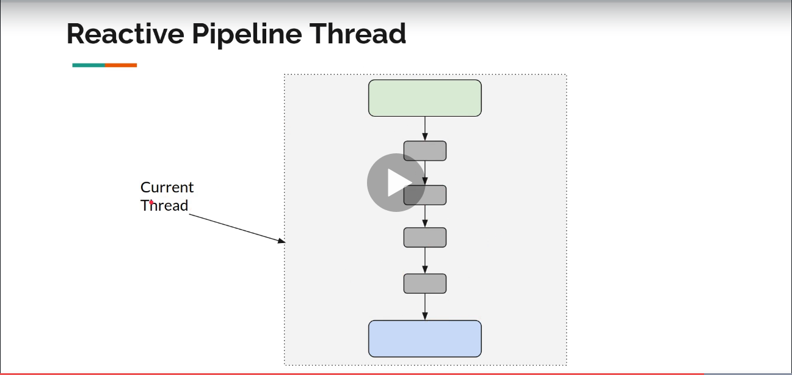

= Spring Reactor
:toc:
:icons: font
:url-quickref: https://docs.asciidoctor.org/asciidoc/latest/syntax-quick-reference/

== Spring Reactor

image::img/flux-basic-terminology.png[width=80%]

image::img/flux-basic-step1.png[width=80%]

image::img/flux-basic-step4.png[width=80%]

== Flux - Emitting Items Programmatically

image::img/flux-create-generate.png[width=80%]

https://github.com/mwwojcik/mw-chat/blob/main/src/test/java/mw/chat/reactor/ReactorFluxGenerateAndCreateComparisonTest.java[See: ReactorFluxGenerateAndCreateComparisonTest.java]

https://github.com/mwwojcik/mw-chat/blob/main/src/test/java/mw/chat/reactor/ReactorFluxCreateTests.java[See: ReactorFluxCreateTests.java]

https://github.com/mwwojcik/mw-chat/blob/main/src/test/java/mw/chat/reactor/fileservice[See: Reactive text file content]

== Flux operators

=== DelayElements

https://github.com/mwwojcik/mw-chat/blob/main/src/test/java/mw/chat/reactor/operators/DelayElementsOperatorTest.java[See: DelayElementsOperatorTest.java]

=== FlatMap

https://github.com/mwwojcik/mw-chat/blob/main/src/test/java/mw/chat/reactor/operators/FlatMapOperatorTest.java[See: FlatMapOperatorTest.java]

=== Handle

https://github.com/mwwojcik/mw-chat/blob/main/src/test/java/mw/chat/reactor/operators/HandleOperatorTest.java[See: HandleOperatorTest.java]

=== IfEmpty
https://github.com/mwwojcik/mw-chat/blob/main/src/test/java/mw/chat/reactor/operators/IfEmptyOperatorTest.java[See: IfEmptyOperatorTest.java]

=== LimitRate
https://github.com/mwwojcik/mw-chat/blob/main/src/test/java/mw/chat/reactor/operators/LimitRateOperatorTest.java[See: LimitRateOperatorTest.java]

=== OnError
https://github.com/mwwojcik/mw-chat/blob/main/src/test/java/mw/chat/reactor/operators/OnErrorOperatorTest.java[See: OnErrorOperatorTest.java]

=== SwitchIfEmpty
https://github.com/mwwojcik/mw-chat/blob/main/src/test/java/mw/chat/reactor/operators/SwitchIfEmpty.java[See: SwitchIfEmpty.java]

=== Timeout
https://github.com/mwwojcik/mw-chat/blob/main/src/test/java/mw/chat/reactor/operators/TimeoutOperatorTest.java[See: TimeoutOperatorTest.java]

=== Transform
https://github.com/mwwojcik/mw-chat/blob/main/src/test/java/mw/chat/reactor/operators/TransformOperatorTest.java[See: TransformOperatorTest.java]

== Cold and Hot Publishers

https://www.vinsguru.com/reactor-hot-publisher-vs-cold-publisher/

*Cold Publisher* (Netflix)
----
Publishers by default do not produce any value
unless at least 1 observer subscribes to it.
Publishers create new data producers for each new subscription.
----

https://github.com/mwwojcik/mw-chat/blob/main/src/test/java/mw/chat/reactor/coldhot/ColdPublisherTest.java[See: ColdPublisherTest.java]

*Hot Publisher* (TV,Radio)

----
Hot Publishers do not create new data producer for each new subscription
(as the Cold Publisher does).
Instead there will be only one data producer and all the observers
listen to the data produced by the single data producer.
So all the observers get the same data.
----

https://github.com/mwwojcik/mw-chat/blob/main/src/test/java/mw/chat/reactor/coldhot/HotPublisherTest.java[See: HotPublisherTest.java]

.Image caption
image::img/hot-publisher.png[Hot and Cold Publishers - Summary,width=80%]

== Threading and scheduling'

=== Default processing model

By default, all operations in single pipeline are executed in default Thread.

All steps block current thread!

[source]
----
  @DisplayName("Should execute all pipeline tasks in the same thread")
    @Test
    void shouldExecuteAllPipelineTasksInTheSameThread() {
        Flux flux = Flux.create(fluxSink -> {
            printThreadMessage("create");
            fluxSink.next(1);
        }).doOnNext(i->printThreadMessage("next"));
        flux.subscribe(i->printThreadMessage("Subscribe"));
    }
----

----
22:46:57.972 [Test worker] DefaultThreadingTest - Test worker=>create
22:46:57.972 [Test worker] DefaultThreadingTest - Test worker=>next
22:46:57.973 [Test worker] DefaultThreadingTest - Test worker=>Subscribe
----

In general, by default,  all steps of the process are performed in subscriber thread.

[source]
----
 @DisplayName("Should execute all pipeline tasks in subscriber thread")
    @Test
    void shouldExecuteAllPipelineTasksInSubscriberThread() {
        Flux flux = Flux.create(fluxSink -> {
            printThreadMessage("create");
            fluxSink.next(1);
        }).doOnNext(i->printThreadMessage("next"));

        Runnable r=()->flux.subscribe(i->printThreadMessage("subscribe"));

        for (int i = 0; i < 2; i++) {
            new Thread(r).start();
            Sleeper.sleepSecconds(1);
        }
        Sleeper.sleepSecconds(5);
     }
----

----
22:49:29.103 [Thread-3] DefaultThreadingTest - Thread-3=>create
22:49:29.104 [Thread-3] DefaultThreadingTest - Thread-3=>next
22:49:29.104 [Thread-3] DefaultThreadingTest - Thread-3=>subscribe

22:49:30.099 [Thread-4] DefaultThreadingTest - Thread-4=>create
22:49:30.099 [Thread-4] DefaultThreadingTest - Thread-4=>next
22:49:30.099 [Thread-4] DefaultThreadingTest - Thread-4=>subscribe
----

https://github.com/mwwojcik/mw-chat/blob/main/src/test/java/mw/chat/reactor/threading/DefaultThreadingTest.java[See: DefaultThreadingTest.java]

=== Schedulers and pools

https://spring.io/blog/2019/12/13/flight-of-the-flux-3-hopping-threads-and-schedulers[See: Flight of the Flux 3 - Hopping Threads and Schedulers]

Creating threads on your own is very inefficient and buggy, so the framework provides several pools, which we can use.

image::img/flux-schedulers-pools.png[widht=80%]

=== Scheduler operators

image::img/flux-schedulers-operators.png[widht=80%]

=== SubscribeOn operator
By default, both the producer and the subscriber work in the main thread, but if the subscribeOn() operator is used in the pipeline, the entire flow is switched to the new thread.
All pipeline steps will be run in the new thread.

image::img/flux-schedulers-switchOn.png[widht=80%]

[source]
----
  @DisplayName("Should switch execution to pooled thread after subscribeOn operator")
    @Test
    void shouldSwitchExecutionToPooledThreadAfterSubscribeOnOperator() {
        Flux.create(fluxSink -> {
            printThreadMessage("create");
            fluxSink.next(1);
        })
            .doFirst(() -> printThreadMessage("second"))
            .subscribeOn(Schedulers.boundedElastic())
            .doFirst(() -> printThreadMessage("first"))
            .subscribe((v) -> printThreadMessage("subscribed"));
    }
----

https://github.com/mwwojcik/mw-chat/blob/main/src/test/java/mw/chat/reactor/threading/SubscribeOnOperatorTest.java[See: SubscribeOnOperatorTest.java]

----
21:08:30.066 [Test worker] INFO mw.chat.reactor.threading.SubscribeOnOperatorTest - Test worker=>first
21:08:30.071 [boundedElastic-1] INFO mw.chat.reactor.threading.SubscribeOnOperatorTest - boundedElastic-1=>second
21:08:30.076 [boundedElastic-1] INFO mw.chat.reactor.threading.SubscribeOnOperatorTest - boundedElastic-1=>create
21:08:30.077 [boundedElastic-1] INFO mw.chat.reactor.threading.SubscribeOnOperatorTest - boundedElastic-1=>subscribed
----

In this case, we can observe an interesting behavior of the onFirst operator.

Documentation says:

----
Add behavior (side-effect) triggered before the Flux is subscribed to, which should be the first event after assembly time.
----

It was executed very early, before subscribeOn operator, and before thread switching.

It should be remembered that if the pipeline contains many onFirst operators, they are invoked in the reverse order

----
 Note that when several doFirst(Runnable) operators are used anywhere in a chain of operators, their order of execution is reversed compared to the declaration order (as subscribe signal flows backward, from the ultimate subscriber to the source publisher):

 Flux.just(1, 2)
     .doFirst(() -> System.out.println("three"))
     .doFirst(() -> System.out.println("two"))
     .doFirst(() -> System.out.println("one"));
 //would print one two three

----